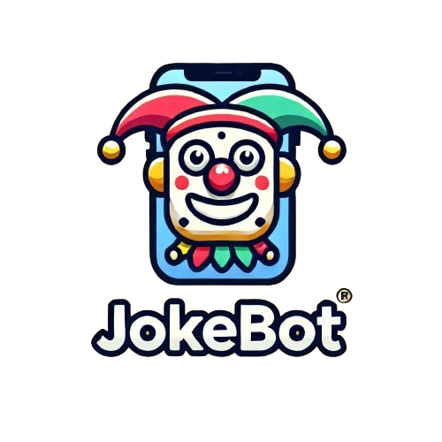

# JokeBot 🤖



## Bienvenue dans l'univers de JokeBot !

Si vous avez toujours rêvé de parler à un chatbot qui raconte des blagues (pas toujours drôles), donne des informations sur l'année scolaire à EPSI (bon, en fait il vous demande d'aller chercher les informations vous-même) et peut même tenter de faire des backflips, alors vous êtes au bon endroit. JokeBot est là pour vous faire rire... ou du moins essayer. 🙃

### Installation et configuration

1. **Cloner le repo**
    ```bash
    git clone https://github.com/votre-username/jokebot.git
    cd jokebot
    ```

2. **Installer les dépendances**
    ```bash
    pip install rasa
    pip install rasa-sdk
    pip install requests
    pip install pyautogui
    ```

3. **Configurer les fichiers**
    - **endpoints.yml** : Assurez-vous que l'URL pointe vers votre serveur d'actions.
    - **domain.yml** et **stories.yml** : Ces fichiers sont déjà configurés pour répondre à vos besoins les plus farfelus.

### Démarrage du bot

1. **Entraîner le modèle**
    ```bash
    rasa train
    ```

2. **Lancer le serveur d'actions**
    ```bash
    rasa run actions
    ```

3. **Lancer le bot** (dans un autre terminal ou un autre processus)
    ```bash
    rasa shell
    ```

### Fonctionnalités de JokeBot

- **Salutations et adieux** : Parce que commencer et terminer une conversation en beauté, c'est important.
    - "Salut", "Bonjour", "Au revoir", "À plus tard"

- **Blagues diverses** : Une collection de blagues pour tous les goûts, ou presque.
    - "Raconte-moi une blague"
    - "Dis-moi une blague sur les belges"

- **Informations scolaires** : Tout ce que vous devez savoir sur l'année scolaire à EPSI.
    - "Quelles sont les dates importantes pour l'année scolaire à EPSI ?"

- **Backflips numériques** : Vous voulez voir un bot faire des backflips ? Nous aussi, mais tout ce qu'on a c'est cette tentative ridicule.
    - "Fais un backflip"

### Notes de... euh...

- **Humour non garanti** : Les blagues de JokeBot sont certifiées pour ne pas faire rire tout le monde.
- **Compatibilité** : Le bot essaie de faire des backflips sur Windows et macOS, mais sans promesse de succès.
- **Support limité** : Si quelque chose ne fonctionne pas, c'est probablement parce que ce bot est supposé être une récréation.

Profitez bien de ce... euh... truc, et amusez-vous avec JokeBot ! 🤡


### Structure des fichiers de JokeBot

Voici un aperçu des principaux fichiers de JokeBot et comment vous pouvez les personnaliser :

- **actions/actions.py** : Contient les actions personnalisées du bot, comme raconter des blagues ou faire des backflips. Vous pouvez ajouter vos propres actions en créant de nouvelles classes héritant de `Action`.

- **nlu.yml** : Définit les intentions (intents) et les exemples d'expressions pour chaque intention. Ajoutez ou modifiez les exemples pour améliorer la compréhension du langage naturel par le bot.

- **rules.yml** : Contient des règles simples pour les réponses du bot. Par exemple, répondre à une salutation par une autre salutation. Vous pouvez ajouter des règles pour des comportements spécifiques.

- **stories.yml** : Définit des scénarios de conversation pour entraîner le bot sur des interactions plus complexes. Ajoutez des histoires pour couvrir des cas d'utilisation spécifiques.

- **config.yml** : Configure le pipeline de traitement du langage naturel du bot. Vous pouvez modifier les composants du pipeline pour améliorer les performances de traitement du langage.

- **domain.yml** : Définit les intentions, entités, réponses et actions du bot. Vous pouvez personnaliser les réponses du bot ici et ajouter de nouvelles actions ou entités.

- **endpoints.yml** : Configure l'URL pour le serveur d'actions du bot. Assurez-vous que cette URL est correcte pour que les actions personnalisées fonctionnent.

### Personnaliser JokeBot

Si jamais vous voulez modifier ce chatbot, par exemple pour en faire quelque chose de vaguement plus utile :

1. **Ajouter une nouvelle blague**
    - Ouvrez `actions/actions.py`.
    - Ajoutez votre blague à la liste `jokes` dans la classe `ActionTellJoke`.

2. **Ajouter une nouvelle intention**
    - Ouvrez `nlu.yml`.
    - Ajoutez une nouvelle section sous `intent` avec des exemples d'expressions.

3. **Ajouter une nouvelle règle**
    - Ouvrez `rules.yml`.
    - Ajoutez une nouvelle règle sous `rules` pour définir un comportement spécifique en fonction d'une intention.

4. **Ajouter une nouvelle histoire**
    - Ouvrez `stories.yml`.
    - Ajoutez une nouvelle histoire sous `stories` pour entraîner le bot sur un nouveau scénario de conversation.

5. **Modifier les réponses du bot**
    - Ouvrez `domain.yml`.
    - Modifiez ou ajoutez des réponses sous `responses` pour personnaliser ce que dit le bot.

En suivant ces instructions, vous pouvez facilement personnaliser JokeBot pour répondre à vos besoins spécifiques. Amusez-vous à le rendre aussi drôle et utile que possible ! 🎉


---

Fait avec ❤️ et beaucou de 😜


